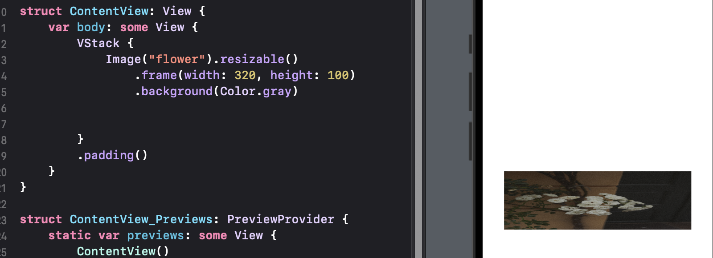
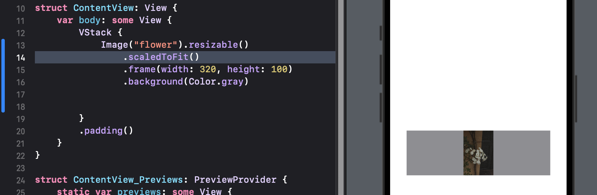
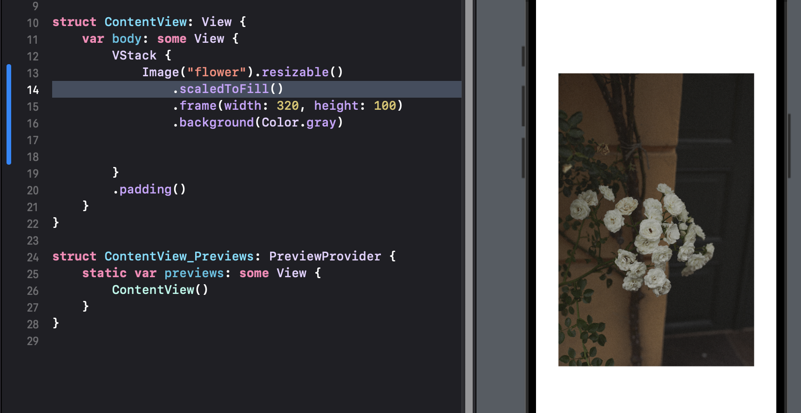

# 2.2 Image


### basic
```swift
Image("image_name")
```

- UIKit에서 UIImageView 생성 후 UIImage를 등록해야 하는 번거로움 없이 Image View를 사용함
- Image는 frame 수식어를 적용해도 이미지의 크기는 변하지 않음 (View의 frame만 바뀜)

### Resizable
- 이미지의 크기를 변경
```swift
func resizable(
    capInsets: EdgeInsets = EdgeInsets(),
    resizingMode: Image.ResizingMode = .stretch
) -> Image
```
- resizable은 Image에서만 사용할 수 있는 수식어이므로 frame 보다 먼저 적용시켜야 함
- default resizingMode는 stretch 모드
```swift
Image("company").resizable()
    .frame(width: 20, height: 40)
```

### ContentMode
|속성 값|note|
|:----|:----|
|default|비율 x, 지정한 프레임에 맞게 이미지가 늘어남|
|.scaledToFit()|원본 비율 유지, 지정한 넓이와 높이 중 작은 값을 기준으로 크기가 조정됨|
|.scaledToFill()|원본 비율 유지, 지정한 넓이와 높이 중 큰 값을 기준으로 크기가 조정됨|


- 이미지 영역이 다음과 같을 때 default 값 (아무 지정도 안함)
##### ScaledToFit

* 넓이와 높이 중 높이가 더 작으므로 높이에 맞추어 이미지 사이즈 변경

##### scaledToFill

* 넓이와 높이 중 넓이가 더 크므로 넓이에 맞추어 이미지 사이즈 변경

### AspectRatio
- 이미지 비율 조정
```swift
            Image("flower").resizable()
                .aspectRatio(CGSize(width: 2, height: 1), contentMode: .fill)
                .frame(width: 320, height: 100)
                .background(Color.gray)
```
- contentMode가 fill 이므로 frame에 지정한 width, height 중 값이 더 큰 width에 맞추어 이미지 사이즈가 조정됨
- aspectRatio에서 비율을 width : height = 2 : 1 므로 넓이가 높이보다 2배로 지정됨


### ClipShape
- 이미지를 원하는 모양으로 지정하여 잘라냄
```swift
            Image("flower").resizable()
                .aspectRatio(CGSize(width: 1, height: 1), contentMode: .fill)
                .frame(width: 300, height: 300)
                .clipShape(Circle().inset(by: 0))
```

- 크기와 위치 지정 가능
```swift
            Image("flower").resizable()
                .aspectRatio(CGSize(width: 1, height: 1), contentMode: .fill)
                .frame(width: 300, height: 300)
                .clipShape(
                    Ellipse().path(in: CGRect(x: 0, y: 150, width: 300, height: 300))
                )
```

### RenderingMode
- template
  - 이미지 불투명 영역이 지정한 색으로 변경하여 템플릿 이미지로 사용

- original
  - 이미지 원본 색 유지

```swift
            Image("flower").resizable()
                .renderingMode(.template)
                .aspectRatio(CGSize(width: 1, height: 1), contentMode: .fill)
                .frame(width: 300, height: 300)
                .clipShape(
                    Ellipse().path(in: CGRect(x: 0, y: 150, width: 300, height: 300))
                )
                .foregroundColor(.red)
```

--------------
## 참고 자료 및 출처
* 스윗한 SwiftUI: [서점 연결](http://www.yes24.com/Product/Goods/89912849)
* 스윗한 SwiftUI: [GitHub](https://github.com/giftbott/SweetSwiftUIExamples)
