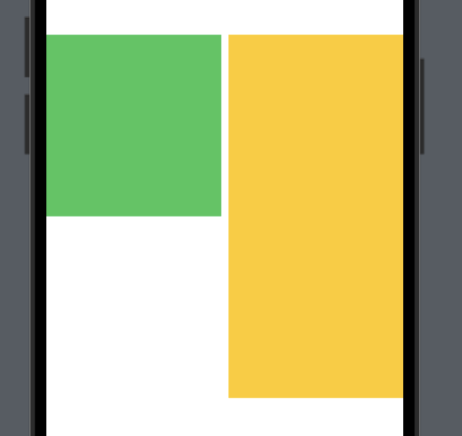
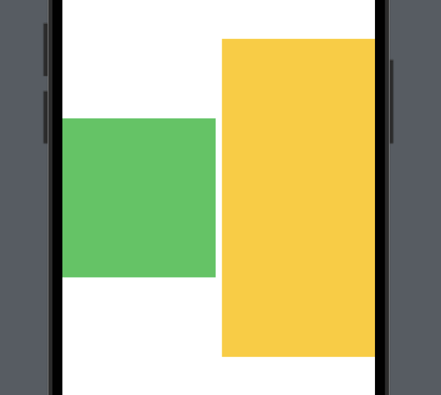

# 2.3 Image

### Intro
- 뷰를 배치하는 데 사용하는 뷰 컨테이너이며 하나의 뷰
- 콘텐츠로 전달된 자식 뷰가 어떻게 배치 될 것인지 정함
```swift
@frozen struct VStack<Content> where Content : View
```
- View를 준수하는 Content를 제네릭 매개변수로 받음 (제네릭 구조체)
- 제네릭 매개변수로 받은 뷰를 자식 뷰로 배치함
```swift
container {
    content
    content
    ...
}
```

------
### VStack
```swift
        VStack {
            Rectangle()
                .fill(.green)
                .frame(width: 200, height: 200)
            Rectangle()
                .fill(.yellow)
                .frame(width: 200, height: 200)
            Rectangle()
                .fill(.brown)
                .frame(width: 200, height: 200)
        }
```
- content를 수직으로 배치함  

-------
### HStack
```swift
        HStack {
            Rectangle()
                .fill(.green)
                .frame(width: 200, height: 200)
            Rectangle()
                .fill(.yellow)
                .frame(width: 200, height: 200)
            Rectangle()
                .fill(.brown)
                .frame(width: 200, height: 200)
        }
```
- content를 수평으로 배치함

##### 생성자
```swift
@inlinable public init(alignment: VerticalAlignment = .center, spacing: CGFloat? = nil, @ViewBuilder content: () -> Content)
```
###### alignment
- 콘텐츠 정렬 방식. 기본 값은 center
- 수평 방향으로 뷰를 정렬하기 때문에 alignment는 수직과 관련된 값을 가짐
```swift
HStack(alignment: .top) {
...}
```
|top|center|bottom|
|:--:|:--:|:--:|
||||

###### spacing
```swift
HStack(spacing: 0) {
    ....
}
```
- 기본적으로 지정되어 있는 spacing이 있기 때문에 각 content 사이에 spacing을 두고 배치되게 됨
- spacing을 없애고 싶은 경우 0으로 지정

-------
### ZStack
- content를 z축으로 조정함. depth 스택이라고도 하며 뷰 계층을 쌓아 올림
```swift
        ZStack {
            Rectangle()
                .fill(.green)
                .frame(width: 200, height: 200)
                .offset(x: 80, y: 80)
            Rectangle()
                .fill(.yellow)
                .frame(width: 200, height: 200)
                .offset(x: 40, y: 40)
            Rectangle()
                .fill(.brown)
                .frame(width: 200, height: 200)
        }
```
- 먼저 선언된 view 일 수록 아래에 쌓임. 뎁스가 깊음

### 공간 확장
- Spacer를 사용하는 경우 형제 뷰가 없을 경우 ZStack 크기 만큼 공간 확장이 일어남
- 형재뷰가 있는 경우 Spacer는 형제 뷰의 크기만큼 공간 확장이 일어남
- Color.clear나 Rectable을 이용해서 뷰를 확장할 수 있음
```swift
        ZStack {
            Color.clear
            Text("test").font(.title)
        }.background(.yellow)
```
- ZStack의 영역이 최대로 확장 됨

-------
### 수식어

##### padding
```swift
        HStack {
            ...
        }
        .padding()
```


--------------
## 참고 자료 및 출처
* 스윗한 SwiftUI: [서점 연결](http://www.yes24.com/Product/Goods/89912849)
* 스윗한 SwiftUI: [GitHub](https://github.com/giftbott/SweetSwiftUIExamples)