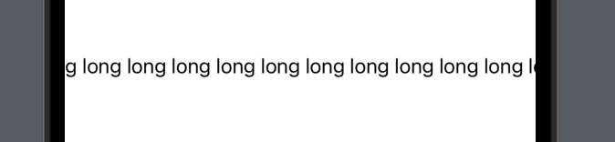
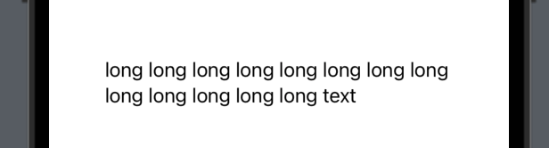

# Operator
-----------------

## ```+(_:_:)```
```swift
static func + (lhs: Text, rhs: Text) -> Text
```
- 새로운 Text view에 두 개의 Text view를 합침
- 더할 각 Text view는 각각 속성을 지정해 줄 수 있음
```swift
Text("Hello World").font(.title).italic()
+ Text("Hello SwiftUI").foregroundColor(.blue)
```

# Modifier
----------

## 폰트
```swift
func font(_ font: Font?) -> Text

// ex)
Text("text view")
    .font(.title)
```

## 커스텀 폰트
```swift
static func custom(_ name: String, size: CGFloat) -> Font

// ex)
Text("test text ui")
    .font(.custom("Menlo", size: 40))
```

## 볼드체
```swift
Text("test text ui")
    .bold()
```

## 이탤릭체
```swift
Text("test text ui")
    .italic()
```

## 밑줄
```swift
Text("test text ui")
    .underline()
```

## 취소선
```swift
Text("test text ui")
    .strikethrough()
```

## 폰트 굵기
```swift
func fontWeight(_ weight: Font.Weight?) -> Text

// ex)
Text("text view")
    .fontWeight(.black)
```

## 폰트 색상
```swift
func foregroundColor(_ color: Color?) -> Text

// ex)
Text("text view")
    .foregroundColor(.red)
```

## 폰트 배경
```swift
func background<S>(_ style: S, ignoresSafeAreaEdges edges: Edge.Set = .all) -> some View where S : ShapeStyle

// ex)
Text("text view")
    .background(Color.gray)
```

## 글자 수 제한
```swift
Text("글자 수 제한 테스트\n새로운 라인")
    .lineLimit(1)
```

## 정렬
```swift
Text("여러 줄일 때 글자\n정렬 테스트")
    .multilineTextAlignment(.center)
```

## (구)sizeToFit
- 라벨 사이즈에 맞게 사이즈를 고정함

- fixedSize를 설정하지 않고 긴 Text를 넣는 경우
```swift
Text("long long long long long long long long long long long long long text")
    .padding(20)
```


- fixedSize를 설정한 경우
```swift
Text("long long long long long long long long long long long long long text")
    .padding(20)
    .fixedSize()
```
